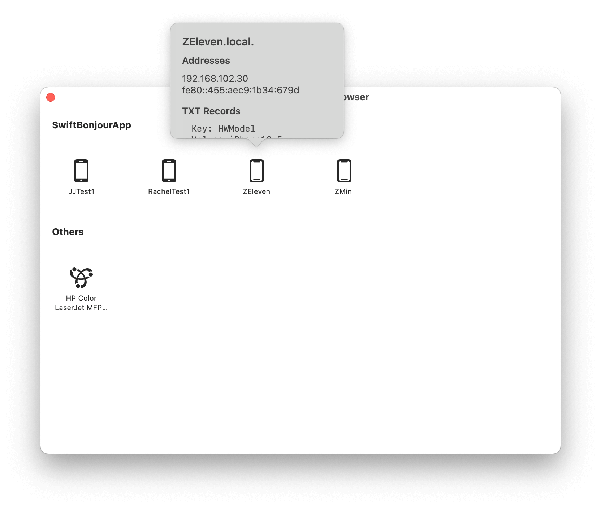

# SwiftBonjour

Using NetService (*Bonjour*) to enable network discovery in your app.


## What's Bonjour?

Bonjour, also known as zero-configuration networking, enables automatic discovery of devices and services on a local network using industry standard IP protocols. Bonjour makes it easy to discover, publish, and resolve network services with a sophisticated, easy-to-use programming interface that is accessible from Cocoa, Ruby, Python, and other languages. [Bonjour - Apple Developer](https://developer.apple.com/bonjour/)


## Example




## Real-World Demo


## Usage

### Swift Package Manager

To use SwiftBonjour as a [Swift Package Manager](https://swift.org/package-manager/) package just add the following in your Package.swift file.

``` swift
dependencies: [
    .package(url: "https://github.com/Lessica/SwiftBonjour.git")
]
```


## Thanks

- [Ciao](https://github.com/AlTavares/Ciao)


## Other Libraries

- [GCDWebServer](https://github.com/swisspol/GCDWebServer)


## License

SwiftBonjour is released under the MIT license. See [LICENSE](https://github.com/Lessica/SwiftBonjour/blob/main/LICENSE) for details.

