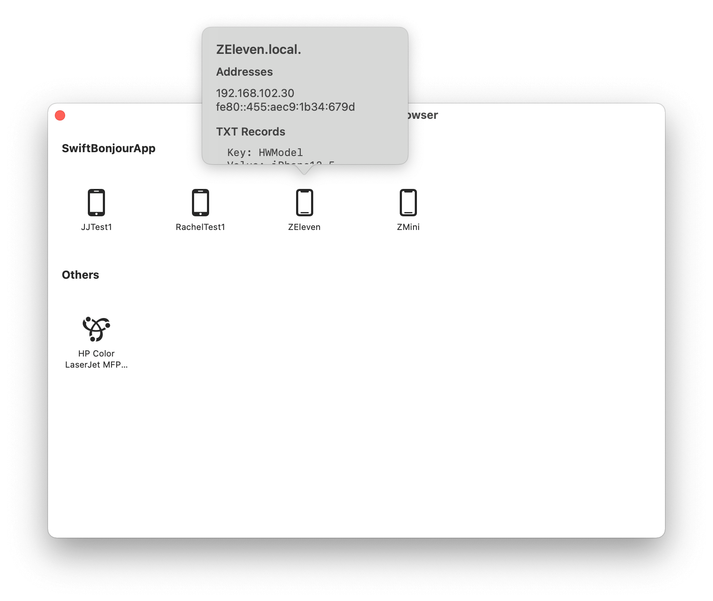
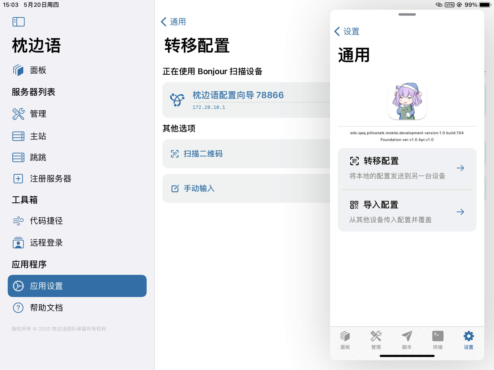

# SwiftBonjour

Using NetService (*Bonjour*) to enable network discovery in your app.

This is a maintained derivative fork of [Ciao](https://github.com/AlTavares/Ciao).


## What's Bonjour?

Bonjour, also known as zero-configuration networking, enables automatic discovery of devices and services on a local network using industry standard IP protocols. Bonjour makes it easy to discover, publish, and resolve network services with a sophisticated, easy-to-use programming interface that is accessible from Cocoa, Ruby, Python, and other languages. [Bonjour - Apple Developer](https://developer.apple.com/bonjour/)


## Example




## Real-World Demo




## Requirements

- Swift 6.2 or later (the package builds in the Swift 6 language mode)
- iOS 15, tvOS 15, visionOS 1, or macOS 12 or later
- Linux, using [Bouke/NetService](https://github.com/Bouke/NetService) with Avahi's `libavahi-compat-libdnssd-dev`. On Linux, `BonjourServer` needs a port greater than 0, because `.listenForConnections` is not supported there.

watchOS has no `NetService`, so the library is empty on watchOS.


## Usage

### Swift Package Manager

To use SwiftBonjour as a [Swift Package Manager](https://swift.org/package-manager/) package just add the following in your Package.swift file.

``` swift
dependencies: [
    .package(url: "https://github.com/Lessica/SwiftBonjour.git", from: "1.0.0")
]
```

### Publish a service

``` swift
let server = BonjourServer(type: .tcp("http"), port: 8080)
server.txtRecord = ["ServerName": "Example"]
server.start { started in
    print("Published:", started)
}
```

### Browse for services

``` swift
let browser = BonjourBrowser()
browser.serviceResolvedHandler = { result in
    if case let .success(service) = result {
        print(service.name, service.port, service.ipAddresses)
    }
}
browser.browse(type: .tcp("http"))
```

Keep a strong reference to the server and the browser for as long as they should run.

### Run loop

`BonjourServer` and `BonjourBrowser` are built on `NetService` and `NetServiceBrowser`, which deliver their callbacks through the run loop of the thread that started them. Start them on a thread whose run loop keeps running, such as the main thread of an app. A process that parks its main thread in `dispatchMain()`, such as a command-line daemon, has no running run loop there, so nothing is ever published or found. Use `NWListener.service` and `NWBrowser` from the Network framework in that case, or run a `RunLoop` on a dedicated thread.

### Local network permission

On iOS, tvOS and visionOS, an app that publishes or browses must list its service types under `NSBonjourServices` and explain the access in `NSLocalNetworkUsageDescription` in its `Info.plist`. Otherwise the system blocks discovery. A sandboxed macOS app needs the `com.apple.security.network.client` and `com.apple.security.network.server` entitlements. The example app under `Example/` shows both.


## Development

``` sh
swift build
swift test        # publishes and browses a real service through the local mDNS responder
swiftformat .     # configuration in .swiftformat
```

`swift test` needs a machine with a working local network. It will not pass in a sandbox or a VM whose network is isolated from mDNS. The example apps live in `SwiftBonjour.xcworkspace`.


## Other Libraries

- [GCDWebServer](https://github.com/swisspol/GCDWebServer)


## License

SwiftBonjour is released under the MIT license. See [LICENSE](https://github.com/Lessica/SwiftBonjour/blob/main/LICENSE) for details.

